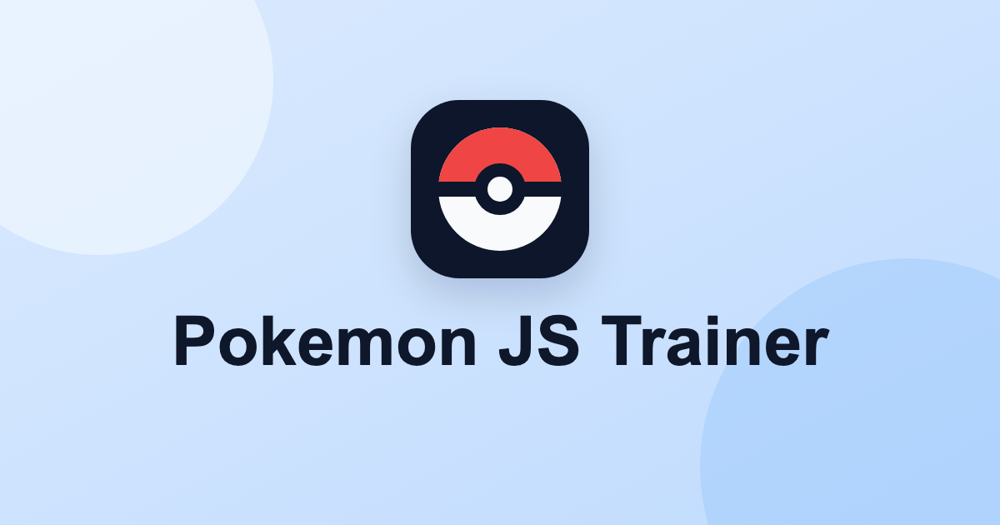
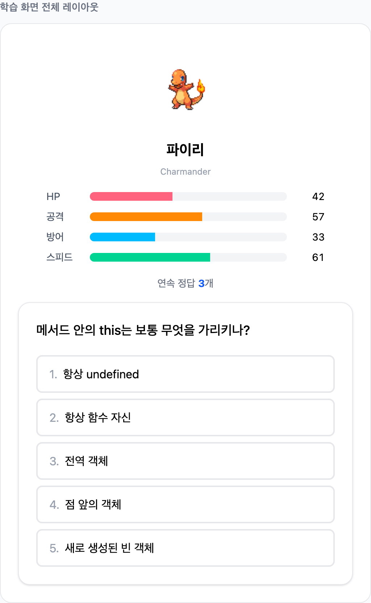
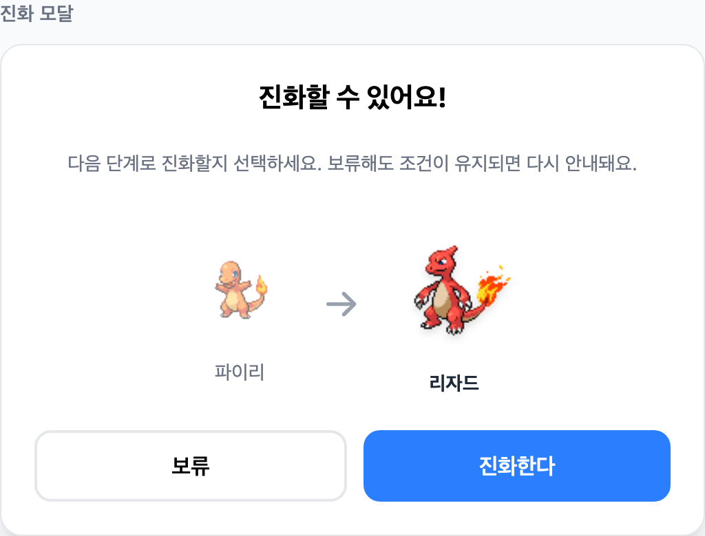
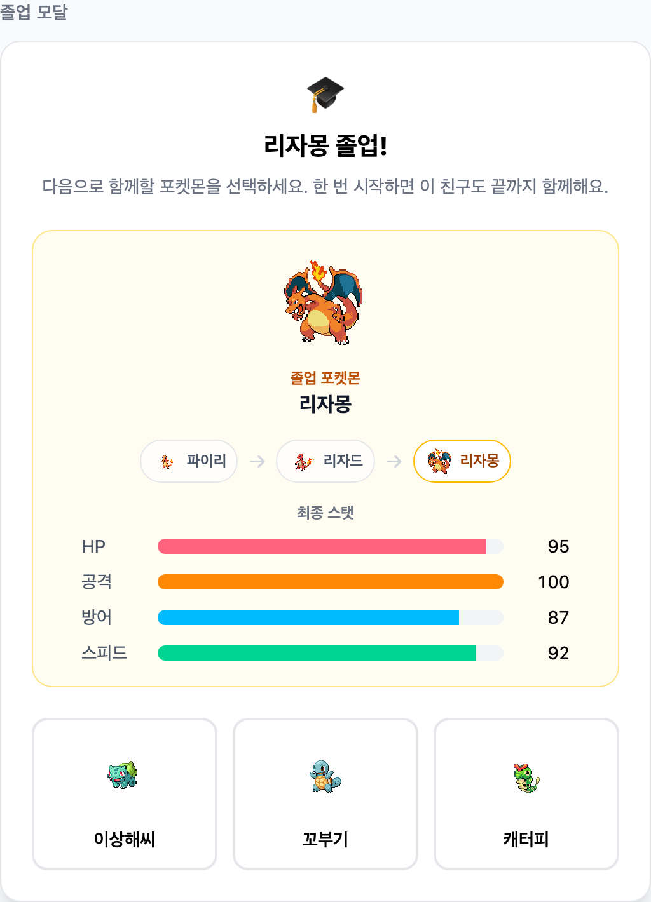
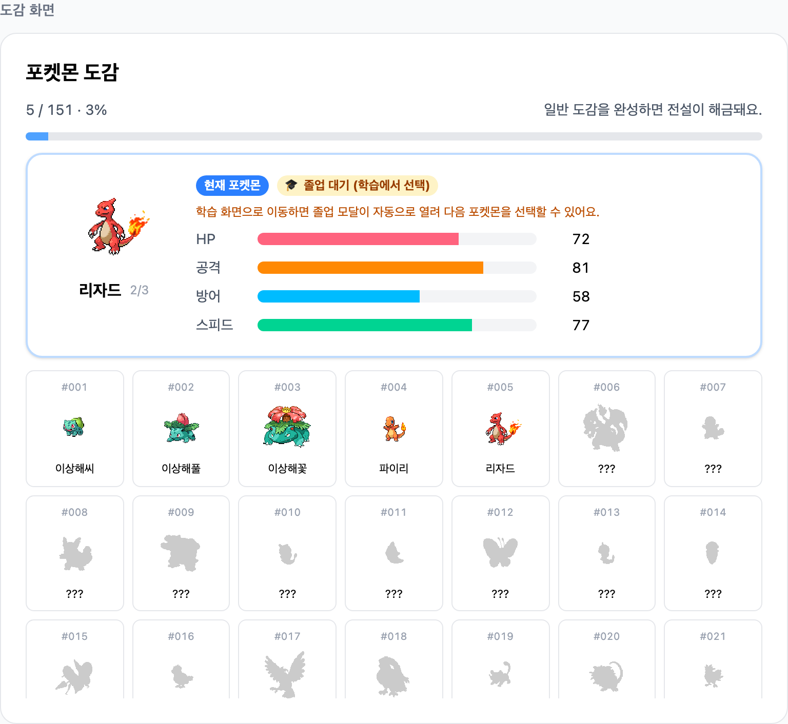

# 포켓몬 JS 트레이너

자바스크립트 코어를 공부하고 싶은데, 막상 시작하면 조금 재미없죠?

그래서 포켓몬이 도와주러 왔어요.

문제를 하나씩 풀 때마다 포켓몬이 자라고, 정답을 맞히면 능력치가 오릅니다.
충분히 성장한 포켓몬은 진화하고, 마지막까지 함께한 포켓몬은 졸업 기록으로
남아요.

## 자바스크립트 공부, 혼자 하면 쉽게 지루해져요

개념은 중요하지만 반복해서 읽고 문제를 푸는 과정은 금방 지칠 수 있어요.
포켓몬 JS 트레이너는 그 반복에 작은 목표와 보상을 더합니다.

## 문제를 풀면 포켓몬이 자라요

정답을 맞히면 포켓몬의 능력치가 오르고, 포켓몬은 조금씩 더 강해집니다.
문제를 풀고 결과를 확인하는 짧은 흐름 안에서 학습 리듬을 이어갈 수 있어요.

## 충분히 성장하면 진화해요

학습을 이어가다 보면 포켓몬은 다음 모습으로 진화합니다. 공부한 시간이 화면
안에서도 눈에 보이게 쌓여요.

## 끝까지 함께하면 졸업해요

한 마리의 포켓몬과 학습 여정을 끝내면 졸업 기록이 남습니다. 그리고 다시
새로운 포켓몬을 선택해 공부를 이어갈 수 있어요.

## 도감을 채워가며 계속 공부해요

졸업한 포켓몬은 도감에 기록됩니다. 공부를 이어갈수록 나만의 포켓몬 도감도
함께 채워져요.

## 지금은 MVP 버전이에요

포켓몬 JS 트레이너는 현재 자바스크립트 코어 학습과 포켓몬 성장 흐름을 먼저
담은 MVP 버전입니다.

지금 할 수 있는 것:

- 이메일로 시작하기
- 자바스크립트 문제 풀기
- 포켓몬 성장시키기
- 진화와 졸업 경험하기
- 졸업한 포켓몬을 도감에서 확인하기

앞으로 더 다듬고 싶은 것:

- 다른 언어 / 주제로 학습 확장하기
- 포켓몬 도감 더 넓히기
- 랭킹?

## 바로 시작하기

[포켓몬 JS 트레이너 시작하기](https://pokemon-frontend-trainer.vercel.app)
